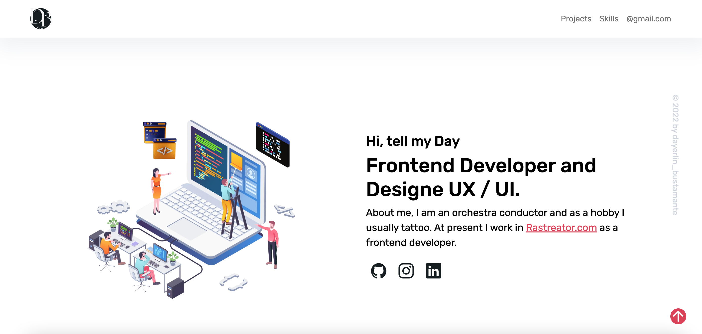

# portfolio-developer

   <a href="https://github.com/dayerlin-bustamante" target="_blank"><ion-icon name="logo-github"></ion-icon></a>
  <a href="https://www.instagram.com/dayerlin_bustamante/?hl=es" target="_blank"><ion-icon name="logo-instagram"></ion-icon></a>
  <a href="https://www.linkedin.com/in/dayerlin-bustamante" target="_blank"><ion-icon name="logo-linkedin"></ion-icon>
  </a>

I have +1 year of experience as a frontend developer, here you will find projects made with different tools and designs for an optimal user interface.

## CV and Certificate

- https://padlet.com/Dayerlin_Bustamante/developerCV
- https://padlet.com/Dayerlin_Bustamante/certificados 

### if you like leave me a star

